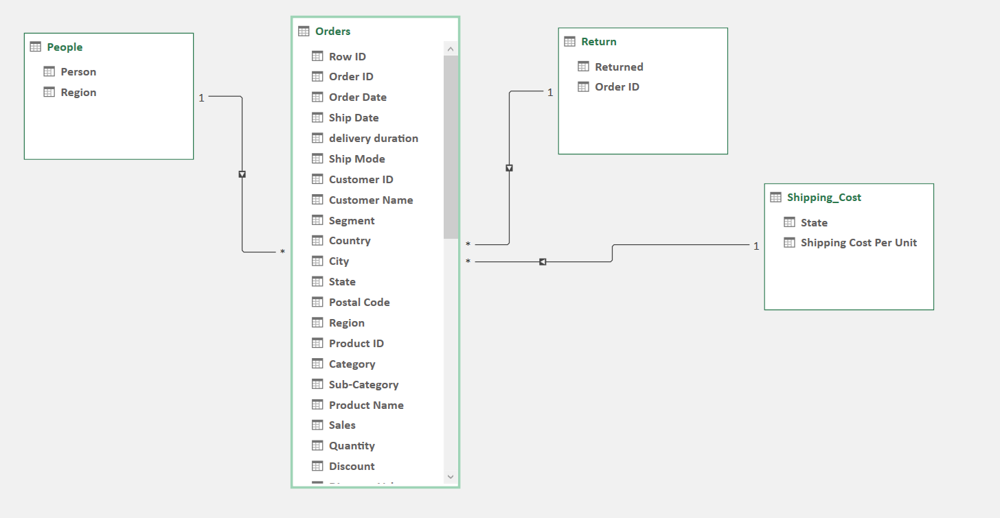
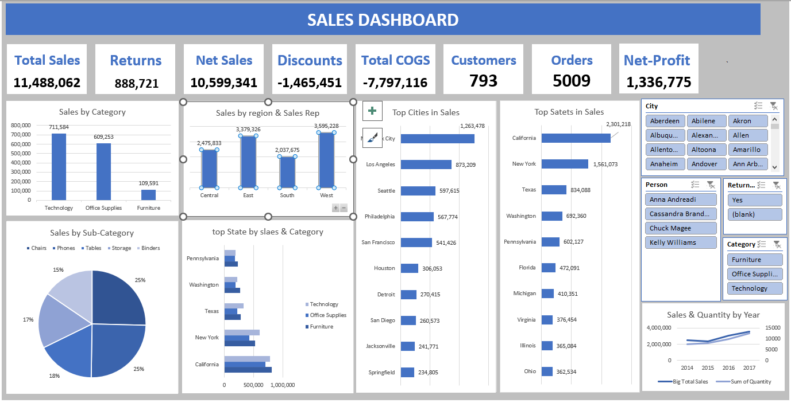

# Sales Analysis using Microsoft Excel

## Project Overview
This project analyzes sales data from 2014 to  2017 using Excel to provide insights into Customer Loyalty, Strengths And Weaknesses, Customer Experience, and Performance .

## Business Problem

## Dataset
The dataset includes:
- Orders  final Data 
- People  Data
- Shipping Cost Data
- Return Data

##  Data Model
The data model follows a star schema with a central Orders fact table connected to dimension tables such as People, Shipping Cost, and Return.

## Data Cleaning

## Excel Features Used

## Dashboard

## Key Insights

## Recommendations

## Folder Structure
│
├── dashboard
├── data
├── docs
├── images
└── README.md

## Tools

## Author

Data Analyst Project by Uosef Eissa
